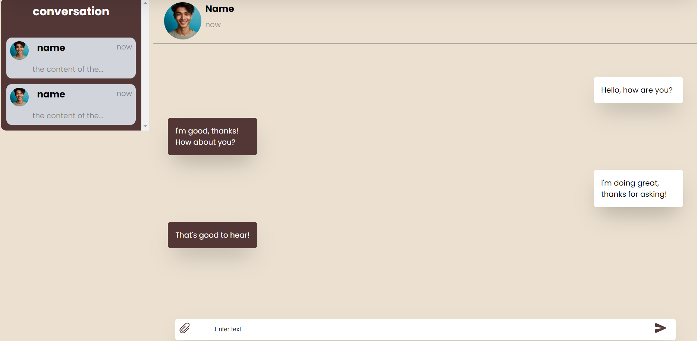
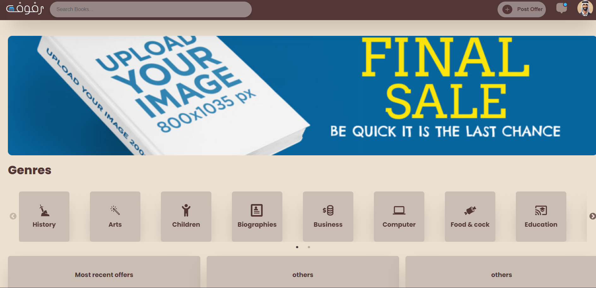
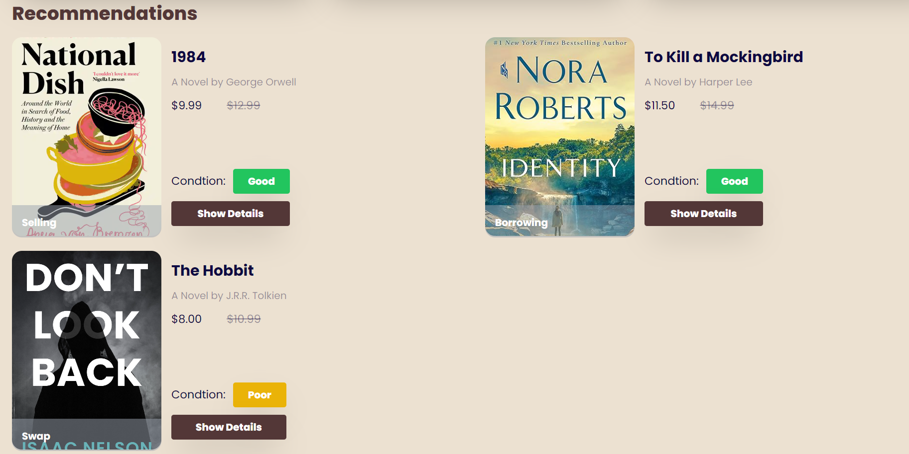
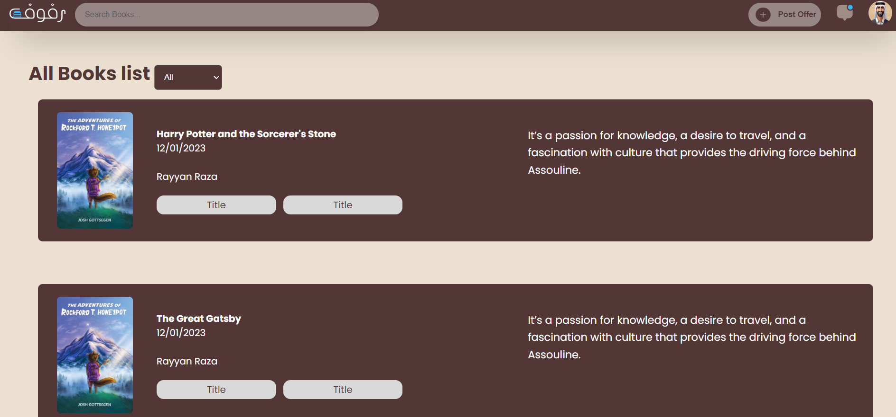
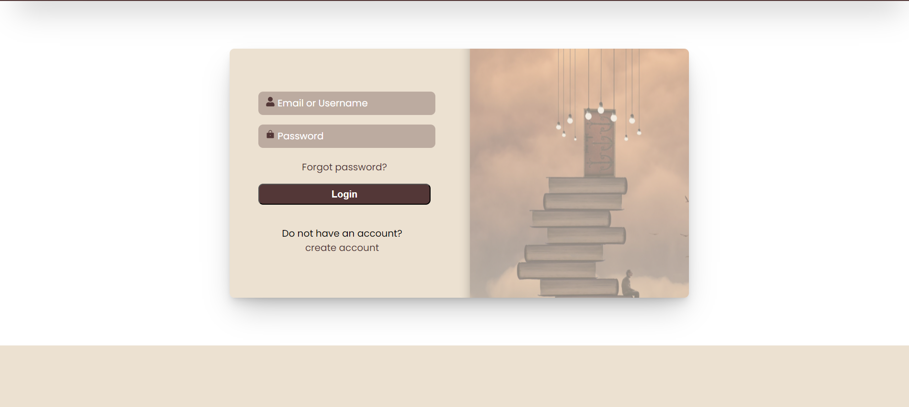
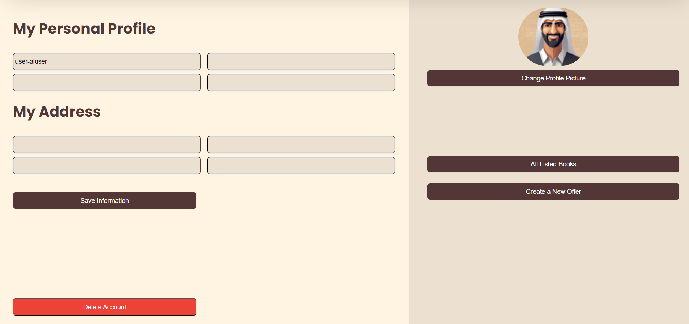
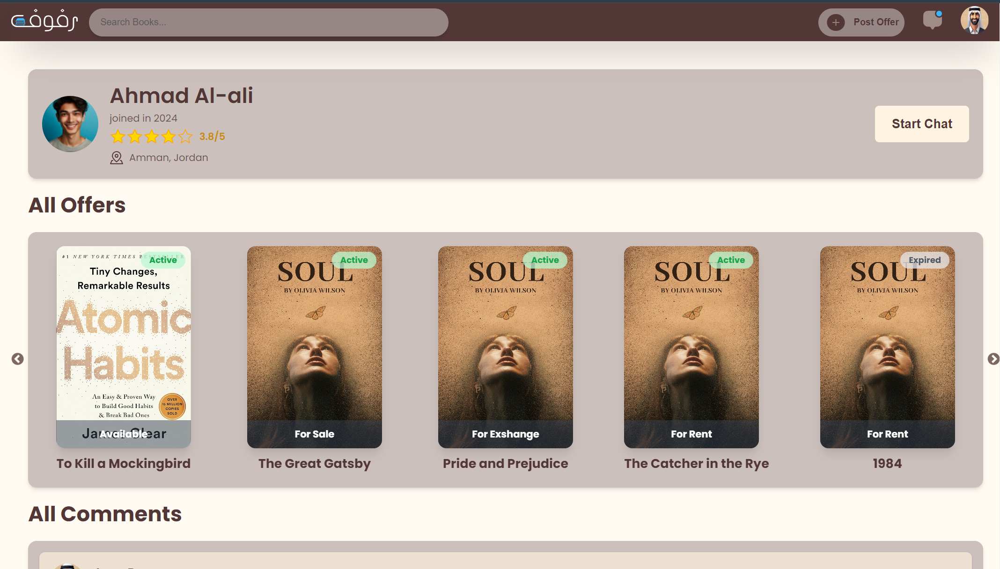
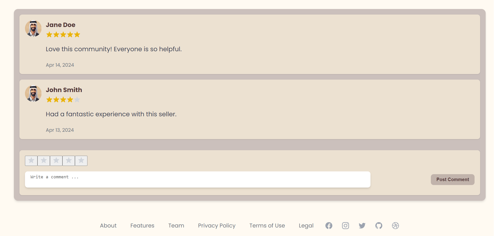

<div align='center'>


<br>
<h1>Rofouf</h1>
<p>Our project proposes the development of an innovative web platform tailored to the unique needs of the Saudi Arabian market, aiming to transform the landscape of book acquisition and literary engagement. At its core, the platform will serve as a dynamic eCommerce hub, enabling users to sell, buy, exchange, or rent used books, thereby making literature more accessible, affordable, and sustainable for all, especially students and young readers. Complementing this, the platform will also cultivate a vibrant community of book lovers, offering spaces for reviews, discussions, book recommendations, and interactions akin to the functionalities found on Goodreads. This dual approach not only addresses the practical challenges of obtaining books in Saudi Arabia, such as high costs and limited availability of rare titles but also fosters a rich cultural exchange, enhancing the intellectual fabric of the community. Through this project, we aim to democratize access to literature and create a thriving ecosystem where books and ideas circulate freely among readers.</p>

</div>

# :notebook_with_decorative_cover: Table of Contents

- [About the Project](#star2-about-the-project)
- [Getting Started](#toolbox-Getting-Started)
- [Roadmap](#compass-roadmap)

## :star2: About the Project

### :camera: Screenshots

<div align="center"> <a href=""></a> </div>
<div align="center"> <a href=""></a> </div>
<div align="center"> <a href=""></a> </div>
<div align="center"> <a href=""></a> </div>
<div align="center"> <a href=""></a> </div>
<div align="center"> <a href=""></a> </div>
<div align="center"> <a href=""></a> </div>
<div align="center"> <a href=""></a> </div>
<div align="center"> <a href=""></a> </div>

### :dart: Features

<b>IMPORTANT NOTE:</b> After receiving confirmation from the doctor that modifications to requirements are acceptable, we've opted to omit the community page from our current scope. It will be integrated into future features.

- register and log in to access the platform
- list books for sale, rent, or exchange
- browse and initiate transactions
- Rental period management and reminders
- Check the seller profile (History, users comments, and all current offerings)
- Direct communication between buyers and sellers to complete the payment transaction.

## :toolbox: Getting Started

### :running: Run Locally

Clone the project

```bash
https://github.com/0xR101/Rofouf.git
```

#### :gear: Installation and Running Instructions for Each Folder

This repository contains two separate folders: `frontend` and `backend`. Each folder represents a distinct component of the application. To successfully install and run the application, follow the instructions below for each folder individually.

**Frontend Folder:**

1. Open your command line interface (CLI) or terminal.
2. Navigate to the `frontend` folder using the `cd frontend` command.
3. Run the following command to install the necessary dependencies:
   ```bash
   npm install or npm i
   ```
4. After the installation is complete, start the development server by running the following command:
   ```bash
   npm run dev
   ```

**Backend Folder:**

1. Open another command line interface (CLI) or terminal window.
2. Navigate to the `backend` folder using the `cd backend` command.
3. Run the following command to install the required dependencies:
   ```bash
   npm install or npm i
   ```
4. Once the installation finishes, start the backend server by executing the following command:
   ```bash
   npm run dev
   ```

By following these steps, you will have two separate servers running simultaneously—one for the frontend and one for the backend. This setup enables the proper functioning of the application, allowing both components to communicate and collaborate effectively.

Please note that it's essential to execute the commands in the respective folders to ensure the correct installation and execution of the frontend and backend components.


## :compass: Roadmap

- [ ] front end
- [ ] backend
